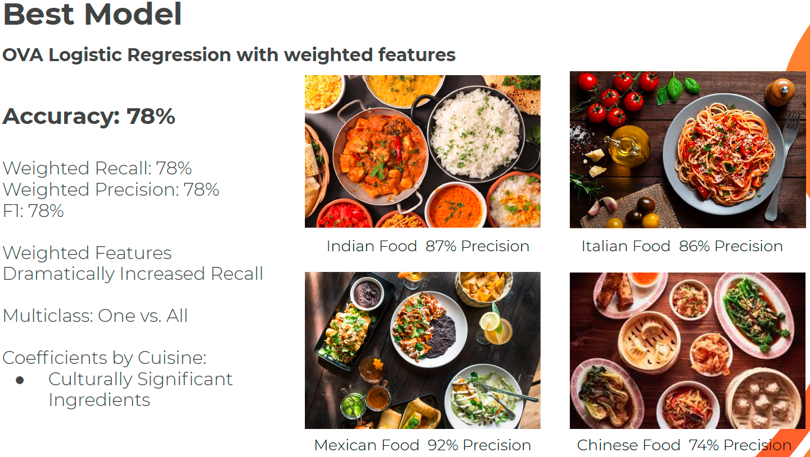
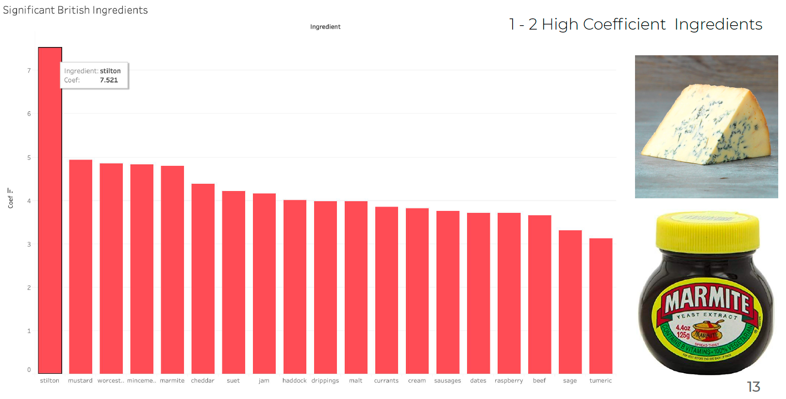
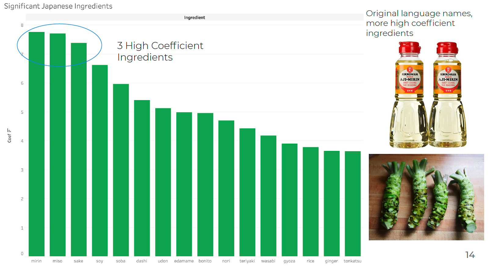
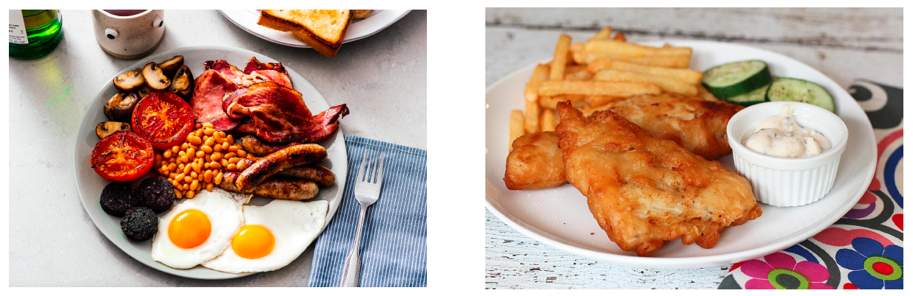
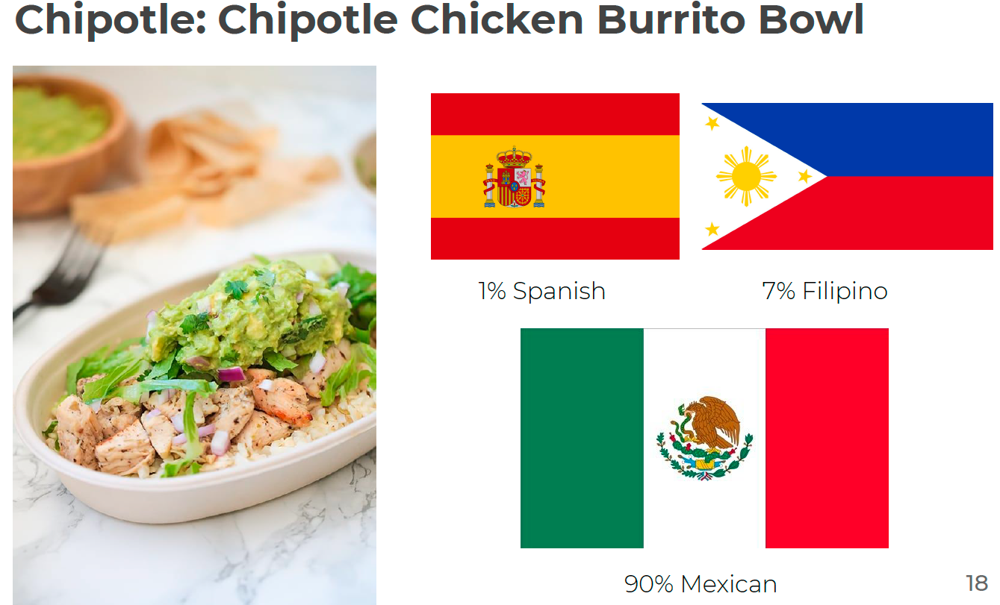
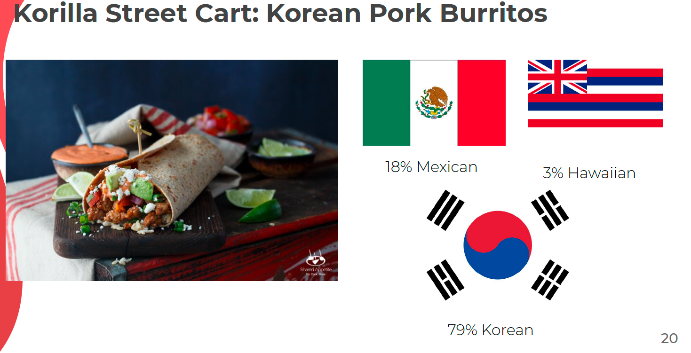
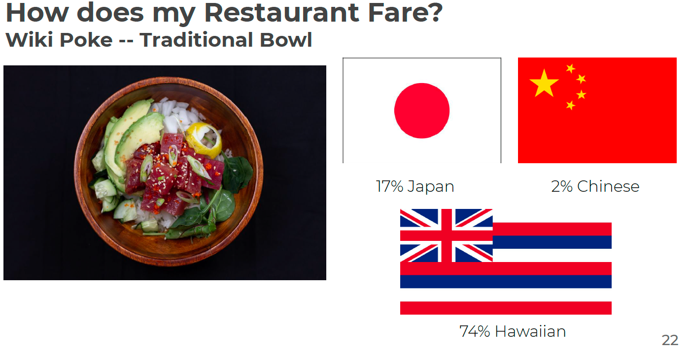

# Classifying Recipes into Cuisines
As a former restauranteur and foodie, I strived to provide authentic culinary experiences through my food and restaurant and seek authentic experiences in food myself. 

I have observed that our generation now a days spend more time and money on experiences than previous generations often times towards the pursuit of authenticity and something unique. 

Food is an experience shaped by history, culture, and geography and having an authentic and enjoyable culinary experiences can be very rewarding. 

**In this project I utilized classification models and natural langauge processing to classify the recipes of different dishes into cuisines.**

## Business Problem/Motivation
Knowing the cuisine of dish is important for restaurants, food delivery and meal kit companies, and consumers. Restaurants need to protect their brand image and attract customers based on their food's authenticity and experience. Food delivery companies and meal kit companies use cuisines as a part of their recommendation systems. Consumers especially foodies want to experience authentic culinary experiences and to understand their cultural palates. 

**I used various classification models to predict cuisine and identify important ingredients that is characteristic of different cuisines.**

## Methodology
**1. Gathering Data**
I gathered data from Kaggle consisting of 21 Cuisines, 3000+ Ingredients, 30000 unique recipes from Yummly

**2. Data Cleaning**
Using Regular Expressions and NLTK, I removed numbers, punctuation, and undercased all recipes. Afterward I vectorized the words using TFIDFvectorizer, which weighted individual ingredients and created a sparse matrix of ingredient weights.

**3. Exploratory Data Analysis**
I created plots and vizualizations for each cuisine to discover the relationships between key ingredients and each cuisine. I discovered class imbalances, for example, there are not many Thai dishes compared to Italian dishes, so I added weights to underrepresented cuisines.

**4. Model Training and Validation**
I split the data into a train set and test set and created a basic KNN model as the Base Model, which achieved an accuracy score of 64%. I improved upon this base model by adjusting parameters and class weights and utilized other more complex models such as logistic regression, OVA naye bayes, decision trees, random forests, and xgBoost. 

**5. Testing**
After tweaking class weights, and implementing NLP data processing techniques, and crossvalidating different models. I arrived at the best performing model, Logistic Regression with Custom Class Weights.

## Findings and Modeling

The best peforming model that I constructed was a One Versus All Logistic Regression with Weighted Features. It produced pretty good results, having 78% in Accuracy, Weighted Recall, Weighted Precision, and F1. Adding weighted features dramtically increased recall and the coefficients of ingredients by cuisine ended up being very insightful culturally signifcant ingredients that can be used to describe the cultural identity of a food.

**Culturally Significant Ingredients**

**English Cuisine**

British cuisine has a number of ingredients with high coefficients. Some notable ingredients include stilton cheese, mustard, and marmite. However notice that there is only one ingredient that really sticks out. This happens alot with Western Cuisine. Ultimately many of these ingredients have English names and there is overlap so that only one or two truly unique ingredients from that cuisine.

**Japanese Cuisine**

Japanese cuisine has many cuisine specific ingredients. These ingredient such as: mirin, miso, sake, wasabi, are linguistically Japanese. So when the vectorizing and modeling these ingredients, they end up all having high coefficients for Japanese cuisine. 

**Insights from Misclassifcations**

Despite my overall good results, I noticed that some seemingly unrelated cuisines were repeatedly misclassified. For example, 20% British and Irish cuisine were misclassified as Southern United States Cuisine. The overlap of ingredients included Potatoes and Fried Breakfast items. It turns out culturally and historically these cuisines were very simliar. Southern United States food was influenced by English cuisine since the colonial times. This observation also occurs in other cross-cultural cuisines such as Hawaiian, Creole, and Mediterranean cuisines. I personally thought this was really interesting since I am drawing insights from mistakes my model made yet these mistakes also confirm my original view about food, an experience that is influenced by historical, cultural, and geographical factors, which interact across cuisines. 

**Other Models**

| Algorithm           | Accuracy                                   | Precision                | Recall              |
| ----------------- | --------------------------------------- | ---------------------------- | ---------------------------|
| Base KNN              | 0.73                    | 0.74 | 0.73|
| OVA Naive Bayes                |  0.66                 | 0.72| 0.66|
| Decision Tree | 0.62                        |  0.62   | 0.62|
| Random Forest  | 0.69|      0.69            | 0.69|
| Logistic Regression (Balanced Weights)  | 0.76| 0.78| 0.76|
| Logistic Regression (Custom Weights)  | 0.78| 0.79 | 0.78|

## Testing My Model On Food Products

For fun, I decided to try my model on a variety of familiar foods that people consume for lunch and see what their cuisine breakdown is. Some of the results are pretty interesting!

Surprisingly enough, Chipotle uses ingredients that are pretty commonly associated with Mexican cuisine and get a high probability for Mexican Cuisine for that reason.

Korean taco truck that specializes in Asian-Mexican Fusion food also yielded interesting results.

Finally, to be fair, I wanted to test out my own Poke Bowls from my restaurant. Here we have a traditional bowl and it turns out my food (thankfully) is relatively authentic with alot of Hawaiian, Japanese, and Chinese influenced ingredients.

## Take Aways

Overall I am very happy with the results of this projects. I found out that ingredients can be used to classify cuisine fairly accurately. High coefficients of logistic regressions indicate signficant ingredients for each particular cuisine. Misclassifications could be due to cultural similiarities, historical influences, and geographical proximity. I feel validated as a foodie and restauranteur learning that I actually offer pretty authentic Hawaiian Poke Bowls!

