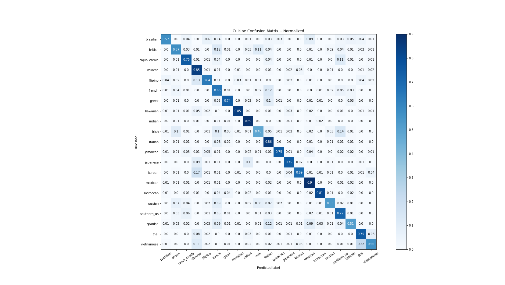

# Classifying Recipes into Cuisines
As a former restauranteur and foodie, I strived to provide authentic culinary experiences through my food and restaurant and seek authentic experiences in food myself. I have observed that our generation now a days spend more time and money on experiences than previous generations often times towards the pursuit of authenticity and something unique. Food is an experience shaped by history, culture, and geography and having an authentic and enjoyable culinary experiences can be very rewarding. **In this project I utilized classification models and natural langauge processing to classify the recipes of different dishes into cuisines.**

## Business Problem/Motivation
Knowing the cuisine of dish is important for restaurants, food delivery and meal kit companies, and consumers. Restaurants need to protect their brand image and attract customers based on their food's authenticity and experience. Food delivery companies and meal kit companies use cuisines as a part of their recommendation system. Consumers especially foodies want to experience authentic culinary experiences and to understand their cultural palates. I used various classification models to predict cuisine and identify important ingredients that is characteristic of different cuisines.

## Methodology
**1. Gathering Data**
I gathered data from Kaggle consisting of 21 Cuisines, 3000+ Ingredients, 30000 unique recipes from Yummly

**2. Data Cleaning**
Using Regular Expressions and NLTK, I removed numbers, punctuation, and undercased all recipes. Afterward I vectorized the words using TFIDFvectorizer, which weighted individual ingredients and created a sparse matrix of ingredient weights.

**3. Exploratory Data Analysis**
I created plots and vizualizations for each cuisine to discover the relationships between key ingredients and each cuisine. I discovered class imbalances, for example, there are not many Thai dishes compared to Italian dishes, so I added weights to underrepresented cuisines.

**4. Model Training and Validation**
I split the data into a train set and test set and created a basic KNN model as the Base Model, which achieved an accuracy score of 64%. I improved upon this base model by adjusting parameters and class weights and utilized other more complex models such as logistic regression, OVA naye bayes, decision trees, random forests, and xgBoost. 

**5. Testing**
After tweaking class weights, and implementing NLP data processing techniques, and crossvalidating different models. I arrived at the best performing model, Logistic Regression with Custom Class Weights.

## Findings and Modeling

The best peforming model that I constructed was a One Versus All Logistic Regression with Weighted Features. It produced pretty good results, having 78% Accuracy, Weighted Recall, Weighted Precision, and F1. Adding weighted features dramtically increased recall and the coefficients of ingredients by cuisine ended up being very insightful culturally signifcant ingredients that can be used to describe the cultural identity of a food.

I found some really interesting ingredients 

English Cuisine

Japanese Cuisine

Insights from Misclassifcations

Other Models

| Algorithm           | R^2                                    | Notes                         |
| ----------------- | --------------------------------------- | ---------------------------- |
| Base Linear Regression               | 0.67                    | Removed New Listings and added Engineered Features |
| Second Degree PolyReg                |  0.05                 | Overfit the test data significantly|
| Linear Regression with Lasso | 0.71                        | Performed Reasonably well       |
| Linear Regression  with Ridge  | 0.70| Performed well                   |
| Polyreg Model with Lasso  | 0.68| Performed well, however after CV, LinReg with Lasso performed better                   |
| Polyreg Model with Ridge  | 0.70| Performed well, however after CV, LinReg with Lasso performed better                   |

## Take Aways

Overall I am very happy with the results of this projects. I found out that ingredients can be used to classify cuisine fairly accurately. High coefficients of logistic regressions indicate signficant ingredients for each particular cuisine. Misclassifications could be due to cultural similiarities, historical influences, and geographical proximity. I feel validated as a foodie and restauranteur learning that I actually offer pretty authentic Hawaiian Poke Bowls!

